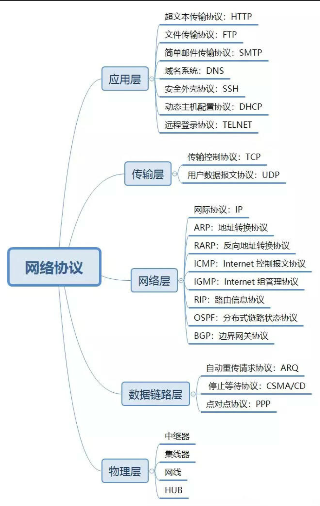
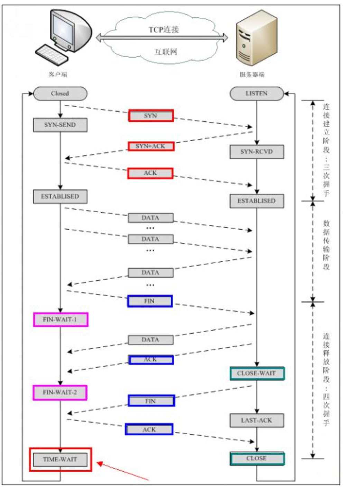
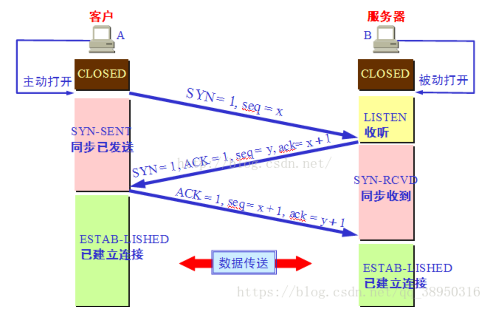
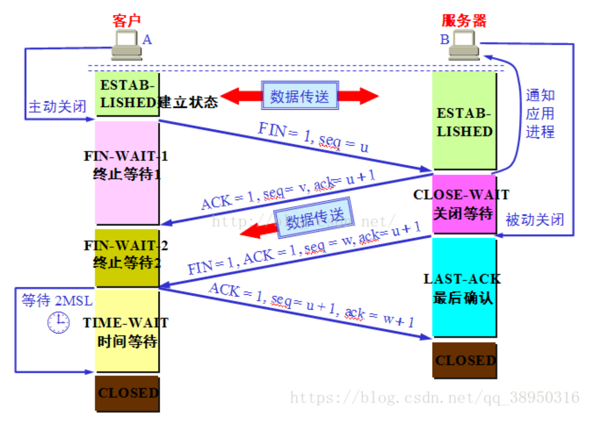

# 计算机网络复习

## 1.五层网络协议体系结构的理解

**1.应用层（application-layer）**
数据传输基本单位为报文；包含的主要协议：FTP（文件传送协议）、Telnet（远程登录协议）、DNS（域名解析协议）、SMTP（邮件传送协议），POP3协议（邮局协议），HTTP协议（Hyper Text Transfer Protocol）。

**2.传输层（transport layer）**
传输层负责将上层数据分段并提供端到端的、可靠的或不可靠的传输以及端到端的差错控制和流量控制问题；包含的主要协议：TCP协议（Transmission Control Protocol，传输控制协议）、UDP协议（User Datagram Protocol，用户数据报协议）；重要设备：网关。

**3.网络层（Network Layer）**
网络层负责对子网间的数据包进行路由选择。此外，网络层还可以实现拥塞控制、网际互连等功能；基本数据单位为IP数据报；重要的设备：路由器。
包含的主要协议：
　　IP协议（Internet Protocol，因特网互联协议）;
　　ICMP协议（Internet Control Message Protocol，因特网控制报文协议）;
　　ARP协议（Address Resolution Protocol，地址解析协议）;
　　RARP协议（Reverse Address Resolution Protocol，逆地址解析协议）。

**4.数据链路层（Data Link Layer）**
数据链路层为网络层提供可靠的数据传输;基本数据单位为帧；主要的协议：以太网协议；两个重要设备名称：网桥和交换机。

**5.物理层（Physical Layer）**
激活、维持、关闭通信端点之间的机械特性、电气特性、功能特性以及过程特性。该层为上层协议提供了一个传输数据的可靠的物理媒体。简单的说，物理层确保原始的数据可在各种物理媒体上传输。物理层记住两个重要的设备名称，中继器（Repeater，也叫放大器）和集线器。

### 每一层对应的网络协议

## 关于IP地址

**A类地址**以0开头，第一个字节作为网络号，地址范围为：0.0.0.0~127.255.255.255；
**B类地址**以10开头，前两个字节作为网络号，地址范围是：128.0.0.0~191.255.255.255;
**C类地址**以110开头，前三个字节作为网络号，地址范围是：192.0.0.0~223.255.255.255。
**D类地址**以1110开头，地址范围是224.0.0.0~239.255.255.255，D类地址作为组播地址（一对多的通信）；
**E类地址**以1111开头，地址范围是240.0.0.0~255.255.255.255，E类地址为保留地址，供以后使用。

## 关于子网掩码

### 什么是子网掩码？

子网掩码是标志两个IP地址是否同属于一个子网的，也是32位二进制地址，其每一个为1代表该位是网络位，为0代表主机位。它和IP地址一样也是使用点式十进制来表示的。如果两个IP地址在子网掩码的按位与的计算下所得结果相同，即表明它们共属于同一子网中。

### 子网掩码的计算：

对于无须再划分成子网的IP地址来说，其子网掩码非常简单，即按照其定义即可写出：如某B类IP地址为 10.12.3.0，无须再分割子网，则该IP地址的子网掩码255.255.0.0。如果它是一个C类地址，则其子网掩码为 255.255.255.0。其它类推，不再详述。下面我们关键要介绍的是一个IP地址，还需要将其高位主机位再作为划分出的子网网络号，剩下的是每个子网的主机号，这时该如何进行每个子网的掩码计算。

**1）利用子网数来计算**
在求子网掩码之前必须先搞清楚要划分的子网数目，以及每个子网内的所需主机数目。
　　(1) 将子网数目转化为二进制来表示;
　　如欲将B类IP地址168.195.0.0划分成27个子网：27=11011；
　　(2) 取得该二进制的位数，为N；
　　该二进制为五位数，N = 5
　　(3) 取得该IP地址的类子网掩码，将其主机地址部分的的前N位置1即得出该IP地址划分子网的子网掩码。
　　将B类地址的子网掩码255.255.0.0的主机地址前5位置 1，得到 255.255.248.0

**2）利用主机数来计算**
如欲将B类IP地址168.195.0.0划分成若干子网，每个子网内有主机700台：
　　(1) 将主机数目转化为二进制来表示；
　　700=1010111100；
　　(2) 如果主机数小于或等于254（注意去掉保留的两个IP地址），则取得该主机的二进制位数，为N，这里肯定 N<8。如果大于254，则 N>8，这就是说主机地址将占据不止8位；
　　该二进制为十位数，N=10；
　　(3) 使用255.255.255.255来将该类IP地址的主机地址位数全部置1，然后从后向前的将N位全部置为 0，即为子网掩码值。
　　将该B类地址的子网掩码255.255.0.0的主机地址全部置1，得到255.255.255.255，然后再从后向前将后 10位置0,即为：11111111.11111111.11111100.00000000，即255.255.252.0。这就是该欲划分成主机为700台的B类IP地址 168.195.0.0的子网掩码。

## 关于ARP协议与RARP协议

>
>网络层的 ARP 协议完成了 IP 地址与物理地址的映射。首先，每台主机都会在自己的 ARP 缓冲区中建立一个 ARP 列表，以表示 IP 地址和 MAC 地址的对应关系。当源主机需要将一个数据包要发送到目的主机时，会首先检查自己 ARP 列表中是否存在该 IP 地址对应的 MAC 地址：如果有，就直接将数据包发送到这个 MAC 地址；如果没有，就向本地网段发起一个 ARP 请求的广播包，查询此目的主机对应的 MAC 地址。此 ARP 请求数据包里包括源主机的 IP 地址、硬件地址、以及目的主机的 IP 地址。网络中所有的主机收到这个 ARP 请求后，会检查数据包中的目的 IP 是否和自己的 IP 地址一致。如果不相同就忽略此数据包；如果相同，该主机首先将发送端的 MAC 地址和 IP 地址添加到自己的 ARP 列表中，如果 ARP 表中已经存在该 IP 的信息，则将其覆盖，然后给源主机发送一个 ARP 响应数据包，告诉对方自己是它需要查找的 MAC 地址；源主机收到这个 ARP 响应数据包后，将得到的目的主机的 IP 地址和 MAC 地址添加到自己的 ARP 列表中，并利用此信息开始数据的传输。如果源主机一直没有收到 ARP 响应数据包，表示 ARP 查询失败。

**地址解析协议，即ARP（Address Resolution Protocol），是根据IP地址获取物理地址的一个TCP/IP协议。ARP命令可用于查询本机ARP缓存中IP地址和MAC地址的对应关系、添加或删除静态对应关系等。**

### ARP工作流程举例：
　　主机A的IP地址为192.168.1.1，MAC地址为0A-11-22-33-44-01；
　　主机B的IP地址为192.168.1.2，MAC地址为0A-11-22-33-44-02；
　　当主机A要与主机B通信时，地址解析协议可以将主机B的IP地址（192.168.1.2）解析成主机B的MAC地址，以下为工作流程：
　　（1）根据主机A上的路由表内容，IP确定用于访问主机B的转发IP地址是192.168.1.2。然后A主机在自己的本地ARP缓存中检查主机B的匹配MAC地址。
　　（2）如果主机A在ARP缓存中没有找到映射，它将询问192.168.1.2的硬件地址，从而将ARP请求帧广播到本地网络上的所有主机。源主机A的IP地址和MAC地址都包括在ARP请求中。本地网络上的每台主机都接收到ARP请求并且检查是否与自己的IP地址匹配。如果主机发现请求的IP地址与自己的IP地址不匹配，它将丢弃ARP请求。
　　（3）主机B确定ARP请求中的IP地址与自己的IP地址匹配，则将主机A的IP地址和MAC地址映射添加到本地ARP缓存中。
　　（4）主机B将包含其MAC地址的ARP回复消息直接发送回主机A。
　　（5）当主机A收到从主机B发来的ARP回复消息时，会用主机B的IP和MAC地址映射更新ARP缓存。本机缓存是有生存期的，生存期结束后，将再次重复上面的过程。主机B的MAC地址一旦确定，主机A就能向主机B发送IP通信了。

**逆地址解析协议，即RARP，功能和ARP协议相对，其将局域网中某个主机的物理地址转换为IP地址。**

### RARP协议工作流程：

　　（1）给主机发送一个本地的RARP广播，在此广播包中，声明自己的MAC地址并且请求任何收到此请求的RARP服务器分配一个IP地址；

　　（2）本地网段上的RARP服务器收到此请求后，检查其RARP列表，查找该MAC地址对应的IP地址；
　　（3）如果存在，RARP服务器就给源主机发送一个响应数据包并将此IP地址提供给对方主机使用；
　　（4）如果不存在，RARP服务器对此不做任何的响应；
　　（5）源主机收到从RARP服务器的响应信息，就利用得到的IP地址进行通讯；如果一直没有收到RARP服务器的响应信息，表示初始化失败。

## 关于TCP与UDP

### TCP 的主要特点是什么？

1. TCP 是面向连接的。（就好像打电话一样，通话前需要先拨号建立连接，通话结束后要挂机释放连接）；
2. 每一条 TCP 连接只能有两个端点，每一条 TCP 连接只能是点对点的（一对一）；
3. TCP 提供可靠交付的服务。通过 TCP 连接传送的数据，无差错、不丢失、不重复、并且按序到达；
4. TCP 提供全双工通信。TCP 允许通信双方的应用进程在任何时候都能发送数据。TCP 连接的两端都设有发送缓存和接收缓存，用来临时存放双方通信的数据；
5. 面向字节流。TCP 中的“流”（Stream）指的是流入进程或从进程流出的字节序列。“面向字节流”的含义是：虽然应用程序和 TCP 的交互是一次一个数据块（大小不等），但 TCP 把应用程序交下来的数据仅仅看成是一连串的无结构的字节流。

### UDP 的主要特点是什么？
1. UDP 是无连接的；
2. UDP 使用尽最大努力交付，即不保证可靠交付，因此主机不需要维持复杂的链接状态（这里面有许多参数）；
3. UDP 是面向报文的；
4. UDP 没有拥塞控制，因此网络出现拥塞不会使源主机的发送速率降低（对实时应用很有用，如 直播，实时视频会议等）；
5. UDP 支持一对一、一对多、多对一和多对多的交互通信；
6. UDP 的首部开销小，只有 8 个字节，比 TCP 的 20 个字节的首部要短。

### TCP 和 UDP 的区别？
TCP 提供面向连接的服务。在传送数据之前必须先建立连接，数据传送结束后要释放连接。TCP 不提供广播或多播服务。由于 TCP 要提供可靠的，面向连接的运输服务（TCP 的可靠体现在 TCP 在传递数据之前，会有三次握手来建立连接，而且在数据传递时，有确认、窗口、重传、拥塞控制机制，在数据传完后，还会断开连接用来节约系统资源），这难以避免增加了许多开销，如确认，流量控制，计时器以及连接管理等。这不仅使协议数据单元的首部增大很多，还要占用许多处理机资源。 UDP 在传送数据之前不需要先建立连接，远地主机在收到 UDP 报文后，不需要给出任何确认。虽然 UDP 不提供可靠交付，但在某些情况下 UDP 确是一种最有效的工作方式（一般用于即时通信），比如：QQ 语音、 QQ 视频 、直播等等。

### TCP 和 UDP 分别对应的常见应用层协议有哪些？
1. TCP 对应的应用层协议FTP：定义了文件传输协议，使用 21 端口。常说某某计算机开了 FTP 服务便是启动了文件传输服务。下载文件，上传主页，都要用到 FTP 服务。Telnet：它是一种用于远程登陆的端口，用户可以以自己的身份远程连接到计算机上，通过这种端口可以提供一种基于 DOS 模式下的通信服务。如以前的 BBS 是-纯字符界面的，支持 BBS 的服务器将 23 端口打开，对外提供服务。SMTP：定义了简单邮件传送协议，现在很多邮件服务器都用的是这个协议，用于发送邮件。如常见的免费邮件服务中用的就是这个邮件服务端口，所以在电子邮件设置-中常看到有这么 SMTP 端口设置这个栏，服务器开放的是 25 号端口。POP3：它是和 SMTP 对应，POP3 用于接收邮件。通常情况下，POP3 协议所用的是 110 端口。也是说，只要你有相应的使用 POP3 协议的程序（例如 Fo-xmail 或 Outlook），就可以不以 Web 方式登陆进邮箱界面，直接用邮件程序就可以收到邮件（如是163 邮箱就没有必要先进入网易网站，再进入自己的邮-箱来收信）。HTTP：从 Web 服务器传输超文本到本地浏览器的传送协议。
2. UDP 对应的应用层协议DNS：用于域名解析服务，将域名地址转换为 IP 地址。DNS 用的是 53 号端口。SNMP：简单网络管理协议，使用 161 号端口，是用来管理网络设备的。由于网络设备很多，无连接的服务就体现出其优势。TFTP(Trival File Transfer Protocal)：简单文件传输协议，该协议在熟知端口 69 上使用 UDP 服务。

---

## 关于TCP

### 三次握手

TCP 建立连接的过程叫做握手，握手需要在客户和服务器之间交换三个 TCP 报文段。

最初客户端和服务端都处于 CLOSED(关闭) 状态。本例中 A（Client） 主动打开连接，B（Server） 被动打开连接。

一开始，B 的 TCP 服务器进程首先创建传输控制块TCB，准备接受客户端进程的连接请求。然后服务端进程就处于 LISTEN(监听) 状态，等待客户端的连接请求。如有，立即作出响应。第一次握手：A 的 TCP 客户端进程也是首先创建传输控制块 TCB。然后，在打算建立 TCP 连接时，向 B 发出连接请求报文段，这时首部中的同步位 SYN=1，同时选择一个初始序号 seq = x。TCP 规定，SYN 报文段（即 SYN = 1 的报文段）不能携带数据，但要消耗掉一个序号。这时，TCP 客户进程进入 SYN-SENT（同步已发送）状态。

第二次握手：B 收到连接请求报文后，如果同意建立连接，则向 A 发送确认。在确认报文段中应把 SYN 位和 ACK 位都置 1，确认号是 ack = x + 1，同时也为自己选择一个初始序号 seq = y。请注意，这个报文段也不能携带数据，但同样要消耗掉一个序号。这时 TCP 服务端进程进入 SYN-RCVD（同步收到）状态。

第三次握手：TCP 客户进程收到 B 的确认后，还要向 B 给出确认。确认报文段的 ACK 置 1，确认号 ack = y +  1，而自己的序号 seq = x + 1。这时 ACK 报文段可以携带数据。但如果不携带数据则不消耗序号，这种情况下，下一个数据报文段的序号仍是 seq = x + 1。这时，TCP 连接已经建立，A 进入 ESTABLISHED（已建立连接）状态。

###为什么两次握手不可以呢？
为了防止已经失效的连接请求报文段突然又传送到了 B，因而产生错误。比如下面这种情况：A 发出的第一个连接请求报文段并没有丢失，而是在网路结点长时间滞留了，以致于延误到连接释放以后的某个时间段才到达 B。本来这是一个早已失效的报文段。但是 B 收到此失效的链接请求报文段后，就误认为 A 又发出一次新的连接请求。于是就向 A 发出确认报文段，同意建立连接。对于上面这种情况，如果不进行第三次握手，B 发出确认后就认为新的运输连接已经建立了，并一直等待 A 发来数据。B 的许多资源就这样白白浪费了。如果采用了三次握手，由于 A 实际上并没有发出建立连接请求，所以不会理睬 B 的确认，也不会向 B 发送数据。B 由于收不到确认，就知道 A 并没有要求建立连接。

### 为什么不需要四次握手？
有人可能会说 A 发出第三次握手的信息后在没有接收到 B 的请求就已经进入了连接状态，那如果 A 的这个确认包丢失或者滞留了怎么办？我们需要明白一点，完全可靠的通信协议是不存在的。在经过三次握手之后，客户端和服务端已经可以确认之前的通信状况，都收到了确认信息。所以即便再增加握手次数也不能保证后面的通信完全可靠，所以是没有必要的。

### Server 端收到 Client 端的 SYN 后，为什么还要传回 SYN？
接收端传回发送端所发送的 SYN 是为了告诉发送端，我接收到的信息确实就是你所发送的信号了。SYN 是 TCP / IP 建立连接时使用的握手信号。在客户机和服务器之间建立正常的 TCP 网络连接时，客户机首先发出一个 SYN 消息，服务器使用 SYN-ACK 应答表示接收到了这个消息，最后客户机再以 ACK(Acknowledgement`[汉译：确认字符，在数据通信传输中，接收站发给发送站的一种传输控制字符。它表示确认发来的数据已经接受无误]`）消息响应。这样在客户机和服务器之间才能建立起可靠的 TCP 连接，数据才可以在客户机和服务器之间传递。

### 传了 SYN，为什么还要传 ACK？
双方通信无误必须是两者互相发送信息都无误。传了 SYN，证明发送方到接收方的通道没有问题，但是接收方到发送方的通道还需要 ACK 信号来进行验证。

### ·详细说下 TCP 四次挥手的过程·

**第一次挥手**：A 的应用进程先向其 TCP 发出连接释放报文段，并停止再发送数据，主动关闭 TCP 连接。A 把连接释放报文段首部的终止控制位 FIN 置 1，其序号 seq = u（等于前面已传送过的数据的最后一个字节的序号加 1），这时 A 进入 FIN-WAIT-1（终止等待1）状态，等待 B 的确认。请注意：TCP 规定，FIN 报文段即使不携带数据，也将消耗掉一个序号。

**第二次挥手**：B 收到连接释放报文段后立即发出确认，确认号是 ack = u + 1，而这个报文段自己的序号是 v（等于 B 前面已经传送过的数据的最后一个字节的序号加1），然后 B 就进入 CLOSE-WAIT（关闭等待）状态。TCP 服务端进程这时应通知高层应用进程，因而从 A 到 B 这个方向的连接就释放了，这时的 TCP 连接处于半关闭（half-close）状态，即 A 已经没有数据要发送了，但 B 若发送数据，A 仍要接收。也就是说，从 B 到 A 这个方向的连接并未关闭，这个状态可能会持续一段时间。A 收到来自 B 的确认后，就进入 FIN-WAIT-2(终止等待2)状态，等待 B 发出的连接释放报文段。

**第三次挥手**：若 B 已经没有要向 A 发送的数据，其应用进程就通知 TCP 释放连接。这时 B 发出的连接释放报文段必须使 FIN = 1。假定 B 的序号为 w（在半关闭状态，B 可能又发送了一些数据）。B 还必须重复上次已发送过的确认号 ack = u + 1。这时 B 就进入 LAST-ACK(最后确认)状态，等待 A 的确认。

**第四次挥手**：A 在收到 B 的连接释放报文后，必须对此发出确认。在确认报文段中把 ACK 置 1，确认号 ack = w + 1，而自己的序号 seq = u + 1（前面发送的 FIN 报文段要消耗一个序号）。然后进入 TIME-WAIT(时间等待) 状态。请注意，现在 TCP 连接还没有释放掉。必须经过时间等待计时器设置的时间 2MSL（MSL：最长报文段寿命）后，A 才能进入到 CLOSED 状态，然后撤销传输控制块，结束这次 TCP 连接。当然如果 B 一收到 A 的确认就进入 CLOSED 状态，然后撤销传输控制块。所以在释放连接时，B 结束 TCP 连接的时间要早于 A。

### 为什么 TIME-WAIT 状态必须等待 2MSL 的时间呢？

1. 为了保证 A 发送的最后一个 ACK 报文段能够到达 B。这个 ACK 报文段有可能丢失，因而使处在 LAST-ACK 状态的 B 收不到对已发送的 FIN + ACK 报文段的确认。B 会超时重传这个 FIN+ACK 报文段，而 A 就能在 2MSL 时间内（超时 + 1MSL 传输）收到这个重传的 FIN+ACK 报文段。接着 A 重传一次确认，重新启动 2MSL 计时器。最后，A 和 B 都正常进入到 CLOSED 状态。如果 A 在 TIME-WAIT 状态不等待一段时间，而是在发送完 ACK 报文段后立即释放连接，那么就无法收到 B 重传的 FIN + ACK 报文段，因而也不会再发送一次确认报文段，这样，B 就无法按照正常步骤进入 CLOSED 状态。

2.  防止已失效的连接请求报文段出现在本连接中。A 在发送完最后一个 ACK 报文段后，再经过时间 2MSL，就可以使本连接持续的时间内所产生的所有报文段都从网络中消失。这样就可以使下一个连接中不会出现这种旧的连接请求报文段。16、为什么第二次跟第三次不能合并, 第二次和第三次之间的等待是什么?当服务器执行第二次挥手之后, 此时证明客户端不会再向服务端请求任何数据, 但是服务端可能还正在给客户端发送数据（可能是客户端上一次请求的资源还没有发送完毕），所以此时服务端会等待把之前未传输完的数据传输完毕之后再发送关闭请求。 

### 保活计时器的作用？

除时间等待计时器外，TCP 还有一个**保活计时器**（keepalive  timer）。设想这样的场景：客户已主动与服务器建立了 TCP 连接。但后来客户端的主机突然发生故障。显然，服务器以后就不能再收到客户端发来的数据。因此，应当有措施使服务器不要再白白等待下去。这就需要使用保活计时器了。服务器每收到一次客户的数据，就重新设置保活计时器，时间的设置通常是两个小时。若两个小时都没有收到客户端的数据，服务端就发送一个探测报文段，以后则每隔  75 秒钟发送一次。若连续发送 10个 探测报文段后仍然无客户端的响应，服务端就认为客户端出了故障，接着就关闭这个连接。

### TCP 协议是如何保证可靠传输的？

1. 数据包校验：目的是检测数据在传输过程中的任何变化，若校验出包有错，则丢弃报文段并且不给出响应，这时 TCP 发送数据端超时后会重发数据；

2. 对失序数据包重排序：既然 TCP 报文段作为 IP 数据报来传输，而 IP 数据报的到达可能会失序，因此 TCP 报文段的到达也可能会失序。TCP 将对失序数据进行重新排序，然后才交给应用层；

3. 丢弃重复数据：对于重复数据，能够丢弃重复数据；

4. 应答机制：当 TCP 收到发自 TCP 连接另一端的数据，它将发送一个确认。这个确认不是立即发送，通常将推迟几分之一秒；

5. 超时重发：当 TCP 发出一个段后，它启动一个定时器，等待目的端确认收到这个报文段。如果不能及时收到一个确认，将重发这个报文段；

6. 流量控制：TCP 连接的每一方都有固定大小的缓冲空间。TCP 的接收端只允许另一端发送接收端缓冲区所能接纳的数据，这可以防止较快主机致使较慢主机的缓冲区溢出，这就是流量控制。TCP 使用的流量控制协议是可变大小的滑动窗口协议。
   
### 停止等待协议

停止等待协议是为了实现可靠传输的，它的基本原理就是每发完一个分组就停止发送，等待对方确认。在收到确认后再发下一个分组；在停止等待协议中，若接收方收到重复分组，就丢弃该分组，但同时还要发送确认。主要包括以下几种情况：无差错情况、出现差错情况（超时重传）、确认丢失和确认迟到、确认丢失和确认迟到。

### ARQ 协议

**自动重传请求 ARQ 协议**

停止等待协议中超时重传是指只要超过一段时间仍然没有收到确认，就重传前面发送过的分组（认为刚才发送过的分组丢失了）。因此每发送完一个分组需要设置一个超时计时器，其重传时间应比数据在分组传输的平均往返时间更长一些。这种自动重传方式常称为自动重传请求 ARQ。

**连续 ARQ 协议**

连续 ARQ 协议可提高信道利用率。发送方维持一个发送窗口，凡位于发送窗口内的分组可以连续发送出去，而不需要等待对方确认。接收方一般采用累计确认，对按序到达的最后一个分组发送确认，表明到这个分组为止的所有分组都已经正确收到了。

### 滑动窗口

TCP 利用滑动窗口实现流量控制的机制。滑动窗口（Sliding window）是一种流量控制技术。早期的网络通信中，通信双方不会考虑网络的拥挤情况直接发送数据。由于大家不知道网络拥塞状况，同时发送数据，导致中间节点阻塞掉包，谁也发不了数据，所以就有了滑动窗口机制来解决此问题。

TCP 中采用滑动窗口来进行传输控制，滑动窗口的大小意味着接收方还有多大的缓冲区可以用于接收数据。发送方可以通过滑动窗口的大小来确定应该发送多少字节的数据。当滑动窗口为 0 时，发送方一般不能再发送数据报，但有两种情况除外，一种情况是可以发送紧急数据，例如，允许用户终止在远端机上的运行进程。另一种情况是发送方可以发送一个 1 字节的数据报来通知接收方重新声明它希望接收的下一字节及发送方的滑动窗口大小。

### 流量控制
TCP 利用滑动窗口实现流量控制。流量控制是为了控制发送方发送速率，保证接收方来得及接收。接收方发送的确认报文中的窗口字段可以用来控制发送方窗口大小，从而影响发送方的发送速率。将窗口字段设置为 0，则发送方不能发送数据。

### TCP 拥塞控制算法

拥塞控制和流量控制不同，前者是一个全局性的过程，而后者指点对点通信量的控制。在某段时间，若对网络中某一资源的需求超过了该资源所能提供的可用部分，网络的性能就要变坏。这种情况就叫拥塞。

拥塞控制就是为了防止过多的数据注入到网络中，这样就可以使网络中的路由器或链路不致于过载。拥塞控制所要做的都有一个前提，就是网络能够承受现有的网络负荷。拥塞控制是一个全局性的过程，涉及到所有的主机，所有的路由器，以及与降低网络传输性能有关的所有因素。相反，流量控制往往是点对点通信量的控制，是个端到端的问题。流量控制所要做到的就是抑制发送端发送数据的速率，以便使接收端来得及接收。

为了进行拥塞控制，TCP 发送方要维持一个拥塞窗口(cwnd) 的状态变量。拥塞控制窗口的大小取决于网络的拥塞程度，并且动态变化。发送方让自己的发送窗口取为拥塞窗口和接收方的接受窗口中较小的一个。

TCP 的拥塞控制采用了四种算法，即：慢开始、拥塞避免、快重传和快恢复。在网络层也可以使路由器采用适当的分组丢弃策略（如：主动队列管理 AQM），以减少网络拥塞的发生。

**慢开始**： 慢开始算法的思路是当主机开始发送数据时，如果立即把大量数据字节注入到网络，那么可能会引起网络阻塞，因为现在还不知道网络的符合情况。经验表明，较好的方法是先探测一下，即由小到大逐渐增大发送窗口，也就是由小到大逐渐增大拥塞窗口数值。cwnd 初始值为 1，每经过一个传播轮次，cwnd 加倍。

**拥塞避免**： 拥塞避免算法的思路是让拥塞窗口 cwnd 缓慢增大，即每经过一个往返时间 RTT 就把发送方的 cwnd 加 1。

**快重传与快恢复**： 在 TCP/IP 中，快速重传和快恢复（fast retransmit and recovery，FRR）是一种拥塞控制算法，它能快速恢复丢失的数据包。

没有 FRR，如果数据包丢失了，TCP 将会使用定时器来要求传输暂停。在暂停的这段时间内，没有新的或复制的数据包被发送。有了 FRR，如果接收机接收到一个不按顺序的数据段，它会立即给发送机发送一个重复确认。如果发送机接收到三个重复确认，它会假定确认件指出的数据段丢失了，并立即重传这些丢失的数据段。

有了 FRR，就不会因为重传时要求的暂停被耽误。当有单独的数据包丢失时，快速重传和快恢复（FRR）能最有效地工作。当有多个数据信息包在某一段很短的时间内丢失时，它则不能很有效地工作。
